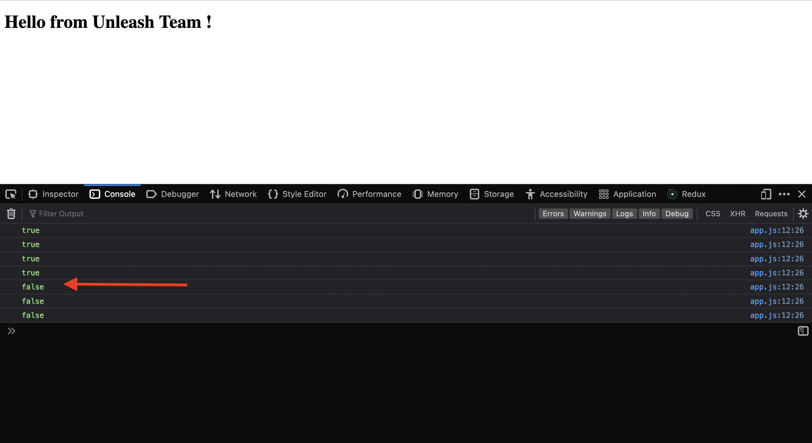

# JavaScript Proxy SDK example
In this tutorial we will use the Unleash JavaScript SDK to enable feature toggling in our Single Page Application.

## Let's get started
1. Create a folder then navigate to the folder through your terminal and type:  
`npm init -y`  
This should create a file called _package.json_.

2. Create two files:

* index.html
* app.js

inside _index.html_ paste the code below

```html
<!DOCTYPE html>
<html lang="en">
  <head>
    <meta charset="UTF-8" />
    <script src="app.js" type="text/javascript"></script>
    <title>Unleash Testing</title>
  </head>
  <body>
    <h1>Hello from Unleash Team !</h1>
  </body>
</html>
```

If you open your _index.html_ you should see something like this 👇
<br/>


Now let's install the JavaScript Proxy SDK, run:

```sh
npm install unleash-proxy-client
```

Let's import the JavaScript Proxy SDK to our html file:

```html
<script
  src="../node_modules/unleash-proxy-client/build/main.min.js"
  type="text/javascript"
></script>
```

Now let initialize the SDK

```js
let config = {
  url: "https://app.unleash-hosted.com/demo/proxy",
  clientKey: "proxy-123",
  refreshInterval: 1, // 1 second
  appName: "my-webapp",
};

let client = new unleash.UnleashClient(config);
client.updateContext({ userId: "123" }); // will be used later
client.start();

console.log(client.isEnabled("my-awesome-feature"));

// this code will log every second the state of our feature
setInterval(() => {
  console.log(client.isEnabled("my-awesome-feature"));
}, 1000);
```

**Note ⚠️:** _my-awesome-feature_ is my feature name. You have to change it with your feature name that you have created. [Don't know how to create a feature ?](https://docs.getunleash.io/user_guide/create_feature_toggle)

Now if we refresh the _index.html_ page and open the console we should see something like this which is the feature state _(depends on your toggle state)_ 👇 
<br/>
 
Note that when we disabled our feature we got _false_ printed in the console.


Now we want to change the background color of our _index.html_ file to _red_ when the feature is on and to _green_ when the feature is off.

To do that we need a function that checks if the state of our feature change to run a some code. Luckly we have the function we need in Unleash JavaScript Proxy SDK 👇

```js
client.on("update", () => {
  // Do something everytime the state of the feature changed.
});
```

so let's add to _app.js_ this code below 👇

```js
client.on("update", () => {
  if (client.isEnabled("my-awesome-feature")) {
    // if the feature is on make bg color red
    document.body.style.backgroundColor = "red";
  } else {
    // if the feature is off make bg color green
    document.body.style.backgroundColor = "green";
  }
});
```

Now if we refresh our _index.html_ and supposing that our feature is on we should see something like this 👇
<br/>


Now if we disabel our feature we should see something like this 👇  
<br/>


## Nice Job 👏 🎉
Now we have made a feature and we connect it to our client app and we were able to enable and disable the feature and see the changes instatly. But before you go let's play around with some strategies. 
If you don't know about strategies take a look 👉 [here](https://docs.getunleash.io/user_guide/activation_strategy).

**UserIDs Strategy**
We will use this strategy to choose which users will recieve the feature using the userId.

1. Go to the feature you created and add a new strategy called UserIDs


Remember the code in app.js 
```js
client.updateContext({ userId: "123" }); // will be used later
```
Notice that we are passing an object that contains a userId. This attribute will be used when we activte the strategy to see if it matches the userId we specified.

so let's add `123` which is our userId to the UserId strategy  
<br/>


**Note ⚠️:** Don't forget to delete the _Standard_ strategy otherwise our feature will be on for every user. 
<br/>


Now if you refresh _index.html_ we should see the same behaviour (backgorund color change when we disable/enable the feature) and that's because the userId we specified in the UserIDs strategy matches the userId our code.

Now what if we change the userId in our code and refresh the _index.html_ file 🤔 ?

Exactly, the feature won't be available for us even if it's on, so we will always get the background color green no matter what is the state of our feature.

**UserIDs Strategy**

Now let's try the IPs Strategy which enable the feature for a specific set of IP addresses. 
So in order to this strategy to work we need to specify our remote address. so let's change the `updateContext` in our code 👇
```js
client.updateContext({remoteAddress: "127.0.0.1"});
```

Now let's create an IPs Strategy and add our remote Address to it. Make sure to delete the _UserIDs Strategy_ we created earlier.

Now if we refresh the _index.html_ file we should that we got the feature working. YESSS 🎊 .

If we change the remoteAdress in our _app.js_ the feature will not be working as the remoteAdress specified in the context doesn't match the address we added to our strategy.

# Congratulation 🎉
If you are reading this that means that you have successfully complete the JavaScript Proxy SDK Example 👏 .
