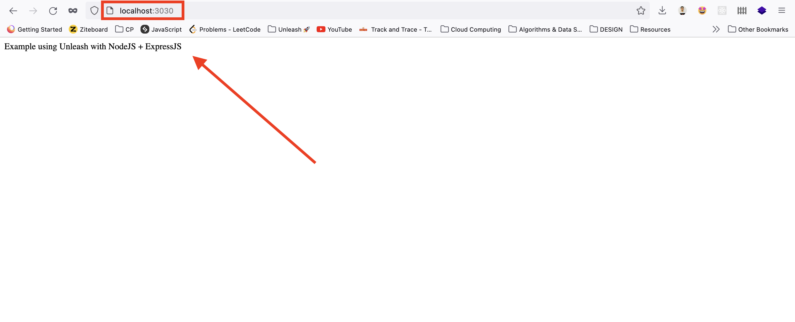
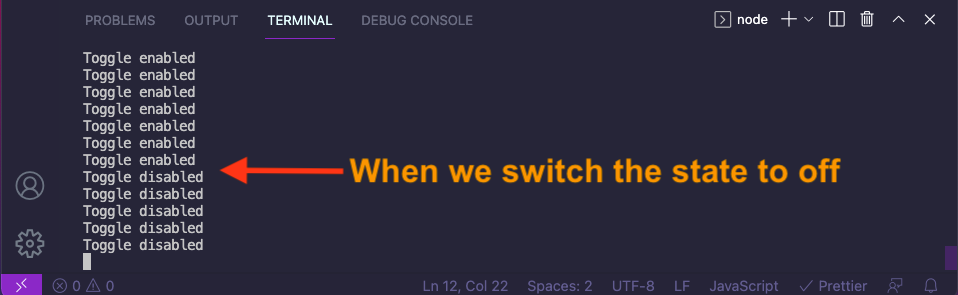
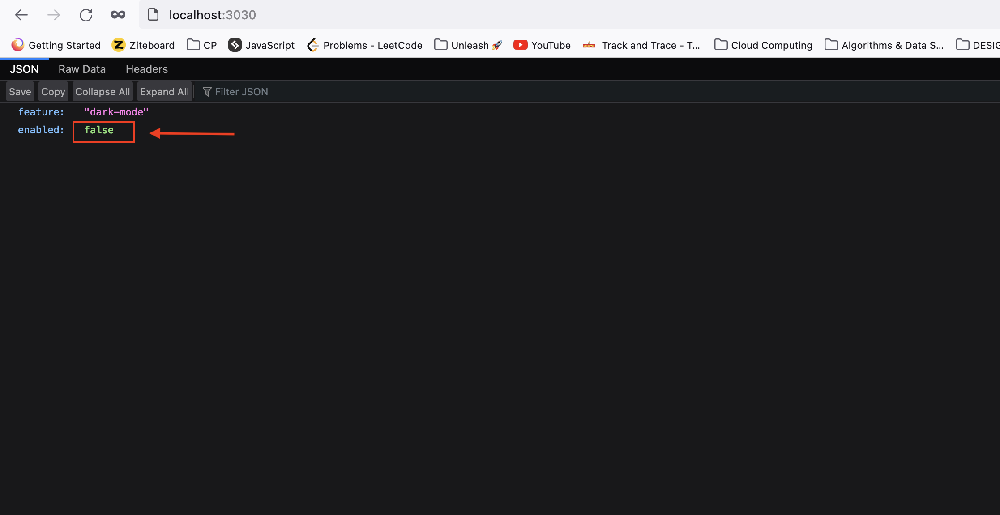
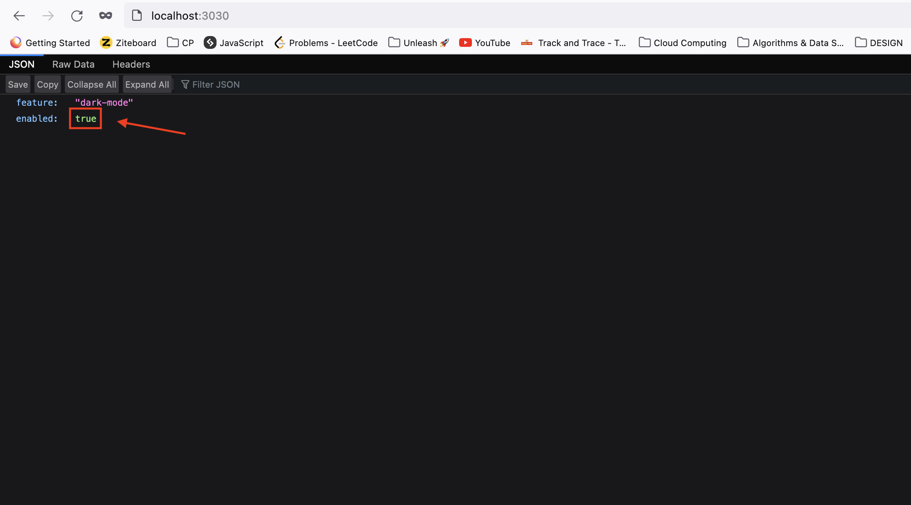

# NodeJS example using ExpressJS

In this example we will create a web-app using ExpressJS and connect it with a feature that we will create using the [NodeJS SDK](https://docs.getunleash.io/sdks/node_sdk).


Before you start make sure you have these tools installed:  
[**Docker**](https://www.docker.com/)  
[**NodeJS**](https://nodejs.org/en/) (version 14 or later)

## Steps

### Step 1: Running Unleash Locally

1. Create a network by typing this command in your terminal:  
```sh 
docker network create unleash
```

2. Start a postgres database:

```sh
docker run -e POSTGRES_PASSWORD=some_password \
-e POSTGRES_USER=unleash_user -e POSTGRES_DB=unleash \
--network unleash --name postgres postgres
```

3. Start Unleash via docker (open another terminal):

```sh
docker run -p 4242:4242 \
-e DATABASE_HOST=postgres -e DATABASE_NAME=unleash \
-e DATABASE_USERNAME=unleash_user -e DATABASE_PASSWORD=some_password \
-e DATABASE_SSL=false \
--network unleash unleashorg/unleash-server
```

Now if we open http://localhost:4242 we should get something like this 👇  
<br/>


You can login with the default admin user:

- username: `admin`
- password: `unleash4all`

Once you are in go ahead and create a feature toggle. [Don't know how ?](https://docs.getunleash.io/user_guide/create_feature_toggle)

### Step 2: Create an Express application

Now let's create a simple server using ExpressJS;

1. Create a folder (for example: NodeJS);
2. Open terminal and navigate to the folder
3. Run `npm init -y`, this should create a file called _package.json_.
4. Now create a file called _server.js_
5. Back to the terminal, we need to install express so run:  
```sh
npm install express
```
7. Now add the following code to the _server.js_ file:

```js
const express = require("express");
const app = express();
const port = 3030;

app.get("/", (req, res) => {
  res.status(200).send("Example using Unleash with NodeJS + ExpressJS");
});

app.listen(port, () => {
  console.log(`Example app listening at http://localhost:${port}`);
});
```

8. Start the server by typing this command in the terminal:

```sh
node server.js
```

now when you open http://localhost:3030 in your browser you should get something like this👇  

<br/>


### Step 3: Connect the SDK with our app

Now in order to use the feature we created earlier in _step 1_ with our express app we need to use the NodeJS Client SDK.

1. Install the sdk using npm:

```sh
npm install unleash-client
```

2. Next we must initialize the client SDK:

```js
const { initialize } = require("unleash-client");
const unleash = initialize({
  url: "http://localhost:4242/api/",
  appName: "my-node-name",
  instanceId: "my-unique-instance-id",
  customHeaders: {
    Authorization: "API TOKEN"
  },
});
```

We need to replace the `API TOKEN` with a real one. So let's go and create a _Client API Key_. [Here's how](https://docs.getunleash.io/user_guide/api-token)

Now let's check if the SDK is connected.

first import isEnabled from unleash-client:
```js
const { initialize, isEnabled } = require("unleash-client");
```

Now add the code below:

```js
setInterval(() => {
    if (unleash.isEnabled('DemoToggle'))
    {    console.log('Toggle enabled');  }
    else {    console.log('Toggle disabled');  }
    }, 1000);
```
**Note ⚠️** : `DemoToggle` should be replaced with your feature toggle name that you created. The first time you do the `isEnabled` call, the SDK may not have had a chance to synchronize with the Unleash API yet, and that you need to listen for the ready event (or away the promise returned from the initialize method) if you want to be guaranteed that it is fully synchronized.  
The Node SDK will on purpose not block the customers application, but the user can choose to block until the SDK has fully synchronized.

Let's execute, run  
```sh 
node server.js 
```
You should see "Toggle enabled" or "Toggle disabled" (depends on your toggle initial state) printed in the console every second, try to change the state of your feature and you should see the changes in the console👇  
<br/>


If you get a similar result that means that your SDK is connected with our app 🎉

### Step 4: Finishing our example

Now let's back to our express app.

We want to send a JSON reponse containing the feature name and the feature status depending on the feature status (enabled or not).

Replace `app.get` with this code👇

```js
app.get("/", (req, res) => {
  if (unleash.isEnabled("dark-mode")) {
    res.status(200).json({
      feature: "dark-mode",
      enabled: unleash.isEnabled("dark-mode")
    });
  } else {
    res.status(200).json({
      feature: "dark-mode",
      enabled: unleash.isEnabled("dark-mode")
    });
  }
});
```

Now let's run it:
```sh
node server.js 
```
Next open http://localhost:3030 and you should see something like this👇  
<br/>



Let's go and change the feature state and refrech the page, you shoud see that the json response changed👇  
<br/>



**Note ⚠️**: The refreshInterval is set to 15s by default.

if you want to change that, add `refreshInterval: 1000` in the initialize object. It should be like this👇:

```js
const unleash = initialize({
  url: "http://localhost:4242/api/",
  appName: "my-app-name",
  instanceId: "my-unique-instance-id",
  refreshInterval: 1000,
  customHeaders: {
    Authorization:
      "21acdfe4fc96dd9bb3268f4d537e00dcc306b27c02d8cbd6ada2d123c86d59cc",
  },
});
```

# Congratulation 🎉
If you are reading this that means that you have successfully complete the NodeJS example 👏 .
