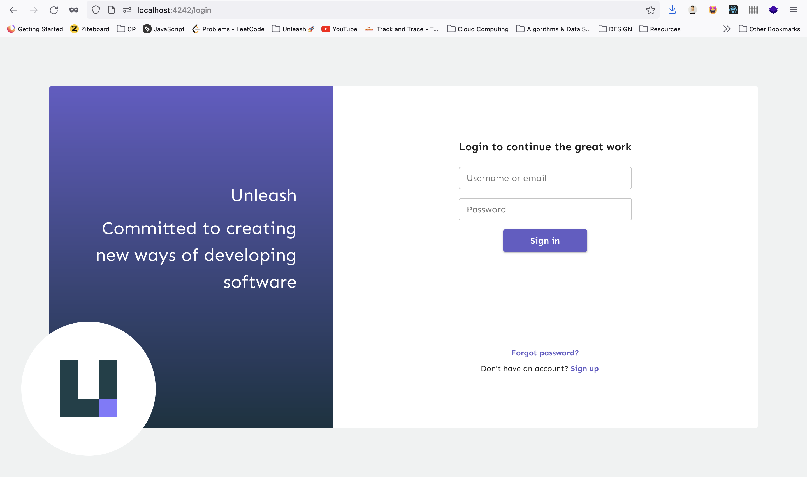
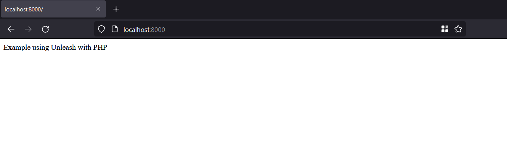
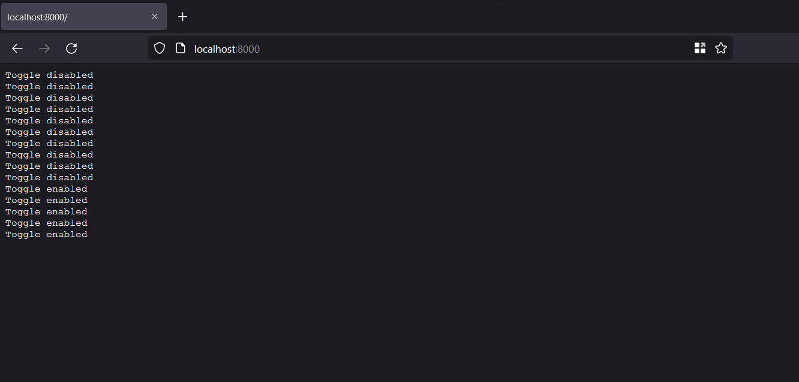
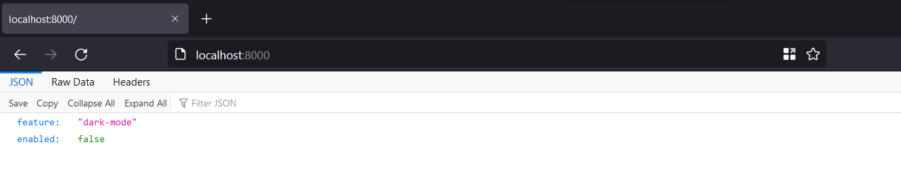
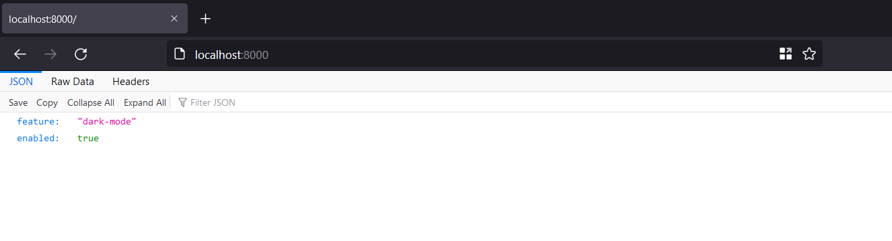

# PHP Example

In this example we will create a web-app using PHP and connect it with a feature that we will create using the [PHP SDK](https://docs.getunleash.io/sdks/php_sdk).

Before you start make sure you have these tools installed:  
[**Docker**](https://www.docker.com/)  
[**PHP**](https://www.php.net/) (version 7.3 or later)  
[**Composer**](https://getcomposer.org/download/)

## Steps

### Step 1: Running Unleash Locally

1. Create a network by typing this command in your terminal:
```sh 
docker network create unleash
```

2. Start a postgres database:

```sh
docker run -e POSTGRES_PASSWORD=some_password \
-e POSTGRES_USER=unleash_user -e POSTGRES_DB=unleash \
--network unleash --name postgres postgres
```

3. Start Unleash via docker (open another terminal):

```sh
docker run -p 4242:4242 \
-e DATABASE_HOST=postgres -e DATABASE_NAME=unleash \
-e DATABASE_USERNAME=unleash_user -e DATABASE_PASSWORD=some_password \
-e DATABASE_SSL=false \
--network unleash unleashorg/unleash-server
```

Now if we open http://localhost:4242 we should get something like this 👇  
<br/>


You can login with the default admin user:

- username: `admin`
- password: `unleash4all`

Once you are in go ahead and create a feature toggle. [Don't know how ?](https://docs.getunleash.io/user_guide/create_feature_toggle)

### Step 2: Create a PHP application

Now let's create a simple PHP application:

1. Create a folder (for example: PHP);
2. Open terminal and navigate to the folder
3. Now create a file called _index.php_
4. Add the following code to the _index.php_ file:
```php
<?php

echo "Example using Unleash with PHP";
```
5. Start the server by typing this command in the terminal:
```sh
php -S 0.0.0.0:8000 
```

now when you open http://localhost:8000 in your browser you should get something like this👇  

<br/>


### Step 3: Connect the SDK with our app

Now in order to use the feature we created earlier in _step 1_ with our PHP app we need to use the PHP Client SDK.

1. Install the sdk using composer:
```sh
composer require unleash/client guzzlehttp/guzzle cache/filesystem-adapter
```

2. Next we must initialize the client SDK:

```php
<?php

require_once __DIR__ . '/vendor/autoload.php';

use Unleash\Client\UnleashBuilder;

$unleash = UnleashBuilder::create()
    ->withAppUrl('http://localhost:4242/api')
    ->withAppName('my-php-name')
    ->withInstanceId('my-unique-instance-id')
    ->withHeader('Authorization', 'API TOKEN')
    ->build();
```

We need to replace the `API TOKEN` with a real one. So let's go and create a _Client API Key_. [Here's how](https://docs.getunleash.io/user_guide/api-token)

Now let's check if the SDK is connected.

Add the code below:

```php
header("Content-Type: text/plain; charset=utf8");
while(true) {
    if ($unleash->isEnabled("DemoToggle")) {
        echo "Toggle enabled";
    } else {
        echo "Toggle disabled";
    }
    echo PHP_EOL;
    ob_flush();
    flush();
    sleep(1);
}
```

**Note ⚠️** : `DemoToggle` should be replaced with your feature toggle name that you created. 

Let's refresh the webpage, you should see "Toggle enabled" or "Toggle disabled" (depends on your toggle initial state) printed on the website every second, try to change the state of your feature and you should see the changes in the browser output👇  



If you get a similar result that means that your SDK is connected with our app 🎉

### Step 4: Finishing our example

Now let's go back to our php app.

We want to send a JSON reponse containing the feature name and the feature status depending on the feature status (enabled or not).

Replace the whole while loop and header() call with this code👇

```php
header("Content-Type: application/json");
echo json_encode([
    'feature' => 'dark-mode',
    'enabled' => $unleash->isEnabled('dark-mode'),
]);
```

Now let's go back to http://localhost:8000 and you should see something like this👇



Let's go and change the feature state and refresh the page, you should see that the json response changed👇  



**Note ⚠️**: The cache TTL is set to 30s by default.

if you want to change that, add `withCacheTimeToLive()` call in the builder. It should be like this👇:

```php
$unleash = UnleashBuilder::create()
    ->withAppUrl('http://localhost:4242/api')
    ->withAppName('my-php-name')
    ->withInstanceId('my-unique-instance-id')
    ->withCacheTimeToLive(1)
    ->withHeader('Authorization', '18ebab53095ef7f058f22eba7ad8ee0ed1375142bd2e5bdccd99ec3482554253')
    ->build();
```

# Congratulation 🎉
If you are reading this that means that you have successfully completed the PHP example 👏 .
