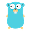
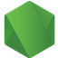
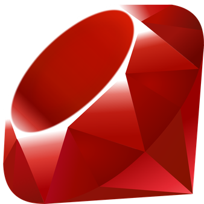
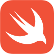

# Unleash SDK Examples

## Server-Side SDKs

| Example                                                                                                |                     |                                                                                                                                                                 | Documentation                                                             |
|--------------------------------------------------------------------------------------------------------|---------------------|-----------------------------------------------------------------------------------------------------------------------------------------------------------------|---------------------------------------------------------------------------|
|  | [C#](./Csharp)      |  | [C# SDK repository](https://github.com/Unleash/unleash-client-dotnet)     |
|            | [Java](./Java)      |    | [Go SDK repository](https://github.com/Unleash/unleash-client-java)       |
|              | [Go](./Go)          |      | [Go SDK repository](https://github.com/Unleash/unleash-client-go)         |
|  | [Node.js](./NodeJS) |  | [Node.js SDK repository](https://github.com/Unleash/unleash-client-node)  |
|           | [PHP](./PHP)        |     | [PHP SDK repository](https://github.com/Unleash/unleash-client-php)       |
|  | [Python](./Python)  |  | [Python SDK repository](https://github.com/Unleash/unleash-client-python) |
|        | [Ruby](./Ruby)      |    | [Ruby SDK repository](https://github.com/Unleash/unleash-client-ruby)     |
|        | [Rust](./Rust)      |    | [Rust SDK repository](https://github.com/Unleash/unleash-client-rust)     |

## Client-Side SDKs

| Example                                                                                                                    |                            |                                                                                                                                                                   | Documentation                                                                     |
| -------------------------------------------------------------------------------------------------------------------------- | -------------------------- | ----------------------------------------------------------------------------------------------------------------------------------------------------------------- | --------------------------------------------------------------------------------- |
|  | [Flutter](./Flutter)       | [Edit in Zapp.run](https://zapp.run/edit/unleash-sdk-examples-z410406wk4105)                                                                                      | [Flutter SDK repository](https://github.com/Unleash/unleash_proxy_client_flutter) |
|          | [JavaScript](./JavaScript) |  | [JavaScript SDK repository](https://github.com/Unleash/unleash-proxy-client-js)   |
|                   | [Next.js](./Next.js)       |     | [Next.js SDK repository](https://github.com/Unleash/unleash-client-nextjs)        |
|                               | [React](./React)           |       | [React SDK repository](https://github.com/Unleash/proxy-client-react)             |
|                      | [Svelte](./Svelte)         |      | [JavaScript SDK repository](https://github.com/Unleash/unleash-proxy-client-js)   |
|                                      | [Swift](./Swift)           |                                                                                                                                                                   | [Swift SDK repository](https://github.com/Unleash/unleash-proxy-client-swift)     |
|                               | [Vue](./Vue)               |         | [JavaScript SDK repository](https://github.com/Unleash/unleash-proxy-client-js)   |
